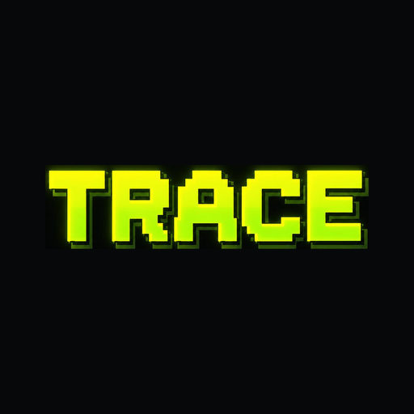
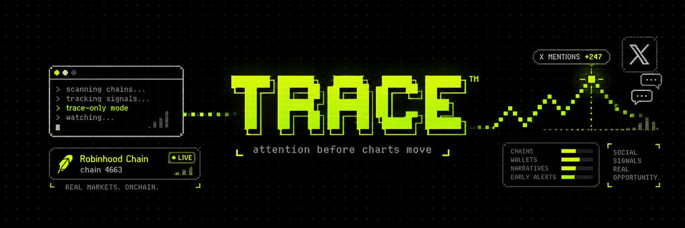

<p align="center">
  
</p>



<p align="center">
<a href="https://trace-terminal.com">trace-terminal.com</a> &middot;
<a href="docs/ATTENTION.md">the finding</a> &middot;
<a href="docs/DETECTOR.md">how it decides</a> &middot;
<a href="docs/SAFETY.md">what it refuses to do</a> &middot;
<a href="docs/DEPLOY.md">put it on a server</a>
</p>

<p align="center">


</p>

**Robinhood Chain launches 17–35 thousand memecoins a day.** Every tool on this
chain reads the chart, which is the consequence. TRACE reads the cause: it
counts how many people are posting about a coin in each five-minute window, and
compares that with what a coin *that age* normally gets.

It says one word — `QUIET`, `WARM`, `SPIKE` — and never anything else. No
target, no score, no buy button, no wallet connect.

---

## The whole thing in five numbers

One day on the chain, 9 September 2026, end to end. Every figure below came out
of the collector's own database, and the command that reproduces it is in the
right-hand column.

| | | how it was cut | reproduce |
|---|---|---|---|
| **30,000** | memecoins launched in a day | off the Pons v2 factory | `python -m trace.watchlist --json` |
| **10** | worth paying to watch | kept only the ones already getting real transfers and real holders | `python -m trace.watchlist` |
| **316** | posts bought, $0.14 for the day | asked X who mentioned each of them, every five minutes | `python -m trace.collector` |
| **107** | posts that counted | refused every post that was really about somebody else's asset | `python -m trace.export --with-posts` |
| **2** | rooms called loud | 9.0× and 3.9× over normal for a token that age | `python -m trace.detector` |

The 209 we paid for and threw away are the interesting ones. See
[what we refuse](#what-we-refuse).

---

## What it is, in three parts

| | | |
|---|---|---|
| **attention** | one collector polls a paid X feed for every watched token and counts mentions per five-minute window | server-side, flat cost, [`trace/collector.py`](trace/collector.py) |
| **book** | reads *your* wallet straight off chain RPC **in your browser** and shows what those entries cost | never touches a server, [`web/book.html`](web/book.html) |
| **desk** | a live local terminal over the collector's own database, refreshing every 15s | [`trace/serve.py`](trace/serve.py) |

The bill scales with posts read, not with users — one collector serves everyone
at flat cost. That is *why* the attention half is server-side and the wallet
half is browser-side, and it is also why the wallet half can promise never to
send your address anywhere: it has no reason to.

---

## Four hard constraints

Not preferences. The code makes them true and CI refuses a commit that breaks them.

1. **No signer, no private key, ever.** No wallet connect for writes. The app
   never builds, signs or sends a transaction. The RPC client refuses any method
   that could broadcast one — an allow-list, not a deny-list, in
   [`trace/rpc.py`](trace/rpc.py).
2. **No buy button.** No link anywhere pre-fills a swap.
3. **No price prediction.** No target, no score, no buy/sell verdict. Counts,
   rates, ratios.
4. **Your wallet never touches our server.** Address entry, RPC reads and all
   PnL maths happen in your browser. No address logged, stored or proxied. Point
   it at any RPC you like, including your own.

Details, and the tests that enforce them, in [docs/SAFETY.md](docs/SAFETY.md).

---

## Sixty seconds

```bash
git clone https://github.com/marlowxbt/trace && cd trace
python3 -m venv venv && source venv/bin/activate
pip install -r requirements.txt
cp config.example.toml config.toml

python -m trace.watchlist            # pick the coins worth paying for
export TRACE_X_BEARER='...'          # your own key, see docs/COST.md
python -m trace.collector --dry-run  # exact queries and the exact bill, no request
python -m trace.collector            # go
python -m trace.serve                # then open http://127.0.0.1:8080
```

`--dry-run` prints every query it *would* send and what it *would* cost before a
cent moves. Nothing in this repository spends money without being asked twice.

Run everything from the repository root: the package is called `trace`, which
shadows the standard library's `trace` module while you are inside it.

---

## Commands

| command | what it does |
|---|---|
| `python -m trace.watchlist` | reads the Pons v2 factory, ranks fresh launches by traction, keeps ten |
| `python -m trace.collector` | polls the feed once per window per token, stores and attributes posts |
| `python -m trace.collector --dry-run` | the queries and the bill, without a request |
| `python -m trace.collector --check` | proves the key works, for the price of one empty call |
| `python -m trace.collector --probe --probe-hours 24` | how much traffic a token *has* had, before committing to it |
| `python -m trace.collector --calibrate` | re-derives the floor from what has actually been measured |
| `python -m trace.detector` | replays the stored windows and prints every verdict |
| `python -m trace.cohort` | the attention-by-age curve (see [the finding](#the-finding-attention-has-a-half-life)) |
| `python -m trace.callers` | who keeps showing up, and how early |
| `python -m trace.export --with-posts` | a public JSON snapshot |
| `python -m trace.serve` | the live desk on `127.0.0.1:8080` |
| `sudo bash deploy/install.sh` | the whole thing on a server, as systemd services — see [DEPLOY](docs/DEPLOY.md) |
| `make test` | 162 offline tests, no network, no key, no cost |

---

## The detector, exactly

```
window      300 seconds, aligned to the epoch
rate        posts in the last COMPLETE window
baseline    this token's own six previous windows, OR the cohort
            normal for its age when it does not have six yet
multiplier  rate / max(baseline, 1.0)
floor       5 posts in a window — below it, nothing ever fires
cooldown    1800 seconds per token after a SPIKE
accounts    distinct authors in the window (reported, never gates)
```

| state | condition |
|---|---|
| `WARMING` | fewer than six fully observed baseline windows, and no cohort normal |
| `QUIET` | multiplier < 1.5 |
| `WARM` | multiplier ≥ 1.5, not loud enough to call, or in cooldown |
| `SPIKE` | multiplier ≥ 3.0 **and** rate ≥ 5 **and** out of cooldown |

**The history rule, one sentence:** a window counts once the whole of it falls
after the moment we actually started asking about that token. An observed window
with zero posts is observed; an unobserved one is missing, not zero. No partial
averaging, no zero padding, no grace period.

The floor gates `SPIKE` only, never `WARM` — otherwise 3.5× on seven posts reads
`QUIET` while 2.9× on thirty reads `WARM`, i.e. acceleration turning into silence
as it speeds up.

Full reasoning, and why `floor` moved from 8 to 5 on live data, in
[docs/DETECTOR.md](docs/DETECTOR.md).

---

## The finding: attention has a half-life

A three-minute-old memecoin has **no normal of its own**. Six windows of history
is thirty minutes, and on this chain the whole event is usually over by then —
measured on real launches, one token's entire run was 13, 11 and 14 posts in
three consecutive windows, *all of it inside the warm-up*, and a detector
waiting for its own baseline was still silent when it ended.

So a token is measured against what a token **that age** normally gets. Same
curve for every coin, no per-token tuning, derived from the corpus itself:

| age | normal, posts per 5-min window | windows behind it |
|---|---|---|
| 0–10m | not measured yet | 20 |
| 10–20m | **1.55** | 20 |
| 20–40m | 0.25 | 40 |
| 40–80m | 0.10 | 80 |
| 80–160m | 0.04 | 160 |
| 160m+ | 0.08 | 205 |

**Attention falls about thirtyfold between a token's first twenty minutes and
its second hour.** A coin's own past *is* its old age — thirty times quieter
than its youth, and useless as a yardstick. A bucket reports nothing until
twelve observed windows stand behind it.

`python -m trace.cohort` regenerates the table. More detail in
[docs/ATTENTION.md](docs/ATTENTION.md).

---

## What we refuse

Two thirds of what we paid for that day did not count, and watching it get
refused is the only reason to trust the third that survives. A post counts if it
carries the contract address, or the cashtag together with a chain marker — and
is vetoed if it names a different contract, or predates the launch.

| refused | why | example |
|---|---|---|
| `$TER` | Teradyne, NASDAQ — a chip-test company with an earnings calendar | 39 posts, 0 counted |
| `$STAG` | STAG Industrial, NYSE — an industrial REIT | 7 posts, 0 counted |
| `$FORK` | a pump.fun token on Solana wearing the same ticker | base58 address, not ours |
| `$HODLster` | **two accounts posting our ticker over somebody else's contract** | `0x974e…39ec`, `0x1c4c…7777` |

That last row is the whole reason attribution exists. A ticker on this chain is
also a NASDAQ symbol, a REIT, a Solana coin and, twice that day, a different
contract entirely.

```bash
python -m trace.export --with-posts --out web/public.json   # every refusal, with its reason
```

---

## Who keeps showing up

The spec always said `accounts.txt` would carry a hand-kept list of callers,
that a name on it would put a red edge on a row, and that it would **never**
change a verdict. `trace/callers.py` is the same idea with the hand taken out:
the list is computed from what the collector already measured, so nobody has to
be trusted to keep it honest and nobody can buy a place on it.

```
covered   how many of the watched tokens it posted about, counted posts only
first_at  minutes after launch of its earliest counted post
led       tokens where it was among the first three counted voices
```

Of 68 accounts that wrote something counted, **nine turned up on more than one
launch in a day**. Those get the mark. It is a deliberately dull rule: an
account that appears on two different launches on the same chain in one day is
either a caller or a bot, and either way it is worth seeing marked.

```
  account                tokens  led  first  median  posts
* @yosefperal1539             4    1   +17m    +41m      4   Fork, HODLster, ROB, TRADE
* @solanatren59241            2    2    +2m     +5m      2   AIP, ROB
* @mostviewcrypto             2    2    +2m     +7m      2   AIP, TRADE
* @solinsidr                  2    0    +4m    +12m      5   Fork, HODLster
```

No follower count, no engagement, no score. A marked account changes nothing —
`detector.evaluate` never reads this file, and a test replays two recorded hours
twice, once with an empty list and once with a list matching every author, and
asserts every state and multiplier is identical.

---

## Cost, and the 33× spread

X moved to pay-per-use. The two feeds worth using are not close:

| feed | per 1 000 posts read |
|---|---|
| twitterapi.io (third party, **default**) | **$0.15** |
| official X API | $5.00 |

A project whose whole public claim is *run the collector yourself with your own
key* should not force the reader to buy the expensive one, so the collector
talks to a **provider** — anything with three methods — and the detector never
learns which one paid. [`trace/feed.py`](trace/feed.py) is the vocabulary,
[`trace/twitterapi.py`](trace/twitterapi.py) and [`trace/xapi.py`](trace/xapi.py)
are the two implementations.

Four things keep the bill honest, and all four are tested:

- **One window, one poll.** Polling faster cannot change a verdict — the
  detector only ever rates a window that has already closed. Ten tokens once a
  minute is **$2.16 a day** before anybody posts a word; the same ten once per
  window is **$0.43**.
- **A cold token buys one minimum page**, not five. An early version paged back
  through 500 posts on first contact, at $2.50 a token.
- **The budget is a hard stop, not a throttle.** When the next request could
  cross the line, the collector exits. It never polls less often or shortens
  pages instead: a detector fed a thinned stream reports `QUIET` for a token that
  is screaming.
- **Every request lands in a `reads` table** with what it returned and what it
  cost, so the bill reconciles against the provider's dashboard line by line.

[docs/COST.md](docs/COST.md) has the arithmetic, including the `-has:links`
filter we removed after checking the docs: the $0.20 link price everybody quotes
is for **writing** a post with a URL, not reading one.

---

## The desk

```bash
python -m trace.collector    # terminal 1 — buys posts, keeps running
python -m trace.serve        # terminal 2 — serves what is already bought
```

`http://127.0.0.1:8080` — the watchlist with each token's current state on the
left, the live post feed on the right, refreshing every fifteen seconds. It
never talks to X: the collector buys posts, the desk only reads what was already
bought, so leaving it open all day costs nothing. If the collector stops, the
page says so in red rather than quietly showing stale numbers.

It binds to loopback, holds no credentials, and makes no outbound request.

---

## Tests

```bash
make test        # 142 tests, offline, no key, no cost
```

Every network call in the project goes through a transport function, which is
why the whole collector runs in tests for free before a cent is spent. The
tests that matter most are the ones that would let money or a wrong verdict
through:

- a recorded two-hour stream replays to byte-identical verdicts
- a cold token buys **one** minimum page
- history begins where we actually started asking, not where the token was added
- the account list changes no state and no multiplier
- `config.example.toml` and the detector's defaults cannot disagree
- an API key with a non-ASCII character is rejected before it reaches a header

CI runs them on Python 3.10 through 3.13 and additionally greps the source for
any signing or transaction-broadcasting call, so constraint 1 cannot rot.

---

## Limitations

- **One chain.** Robinhood Chain only. Nothing here generalises for free.
- **The feed is a third party.** twitterapi.io is not X Corp. If it goes away,
  swap the provider; that is what the abstraction is for.
- **The cohort curve is one day and ten tokens.** It is measured, not
  authoritative. Re-run `--calibrate` as more accumulates.
- **A five-minute window is coarse.** It is chosen so a burst cannot be a single
  account posting eleven times in ninety seconds, and it costs latency.
- **It cannot tell you a coin is good.** It counts people talking. That is the
  entire claim, and the rest of the market is your problem.

More in [docs/LIMITATIONS.md](docs/LIMITATIONS.md).

---

## Docs

| | |
|---|---|
| [SAFETY.md](docs/SAFETY.md) | the four constraints, as code and as tests |
| [DETECTOR.md](docs/DETECTOR.md) | every number, and what moved it |
| [ATTENTION.md](docs/ATTENTION.md) | the by-age curve and how it was built |
| [COST.md](docs/COST.md) | the bill, the traps, the arithmetic |
| [CALLERS.md](docs/CALLERS.md) | the computed list |
| [ARCHITECTURE.md](docs/ARCHITECTURE.md) | how the pieces fit |
| [LIMITATIONS.md](docs/LIMITATIONS.md) | what it does not do |

---

## Built on

Robinhood Chain (EVM, id 4663, `rpc.mainnet.chain.robinhood.com`) · Pons v2
factory `0x7eD598BcEf8bd9Edd8C97A195C6d13f40801EC7e` · twitterapi.io or the
official X API · Python 3.10+ and one runtime dependency.

Numbers in this README were measured on 9 September 2026 and are reproducible
from the commands beside them.

MIT. Run it yourself, with your own key.
